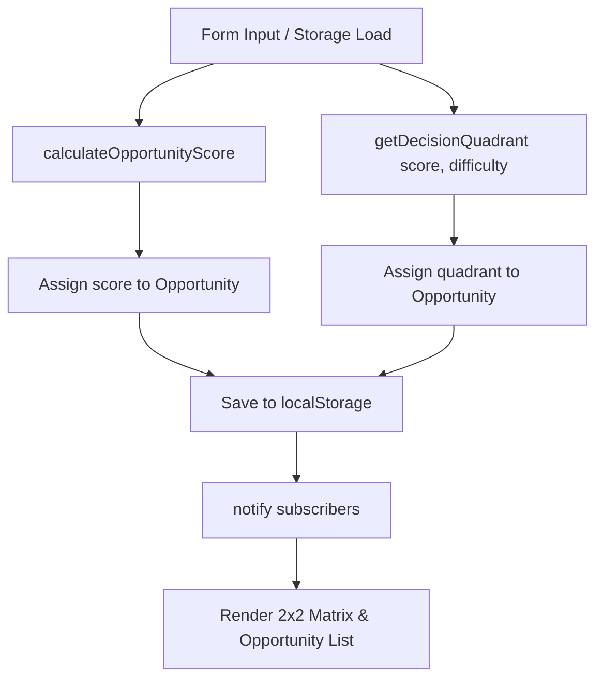

# Data Model & State Schema: AI Decision Matrix

## Entity Model Extensions

### 1. Opportunity (Extended Entity)

The existing `Opportunity` object is extended with an automatically computed `quadrant` property.

```javascript
/**
 * @typedef {Object} Opportunity
 * @property {string} id - UUID gerado automaticamente
 * @property {string} name - Nome do processo (máx 80 caracteres)
 * @property {string} area - Área de negócio
 * @property {string} description - Descrição opcional (máx 300 caracteres)
 * @property {number} impact - Impacto (1 a 5)
 * @property {number} frequency - Frequência (1 a 5)
 * @property {number} manualEffort - Esforço manual (1 a 5)
 * @property {number} repetitivity - Repetitividade (1 a 5)
 * @property {number} dataReadiness - Prontidão de dados (1 a 5)
 * @property {number} difficulty - Dificuldade de implementação (1 a 5)
 * @property {number} score - Opportunity Score calculado (0 a 100)
 * @property {string} priority - Prioridade calculada ('ALTA' | 'MÉDIA' | 'BAIXA')
 * @property {string} quadrant - Quadrante calculado ('QUICK WIN' | 'STRATEGIC' | 'OPPORTUNISTIC' | 'DEPRIORITIZE')
 * @property {number} createdAt - Timestamp de criação (ms)
 */
```

#### Deterministic Quadrant Rules Matrix

| Opportunity Score (`score`) | Dificuldade (`difficulty`) | Quadrante Atribuído (`quadrant`) | Identidade Visual |
| :--- | :--- | :--- | :--- |
| `score >= 80` | `difficulty <= 2` | `QUICK WIN` | Verde (`#10b981` / `--color-quick-win`) |
| `score >= 80` | `difficulty >= 3` | `STRATEGIC` | Azul (`#3b82f6` / `--color-strategic`) |
| `score < 80` | `difficulty <= 2` | `OPPORTUNISTIC` | Amarelo/Âmbar (`#f59e0b` / `--color-opportunistic`) |
| `score < 80` | `difficulty >= 3` | `DEPRIORITIZE` | Vermelho (`#ef4444` / `--color-deprioritize`) |

---

### 2. State & Metrics Extensions

#### Application State (`filters`)
```javascript
this.filters = {
  area: "",         // "" para todas, ou nome da área
  priority: "",     // "" para todas, ou "ALTA" | "MÉDIA" | "BAIXA"
  quadrant: ""      // "" para TODOS, ou "QUICK WIN" | "STRATEGIC" | "OPPORTUNISTIC" | "DEPRIORITIZE"
};
```

#### Summary Metrics (`getSummaryMetrics()`)
```javascript
{
  total: number,                // Total de oportunidades visíveis após filtro
  highPriorityCount: number,    // Total de oportunidades de prioridade ALTA visíveis
  averageScore: number,         // Média do score visível (1 casa decimal)
  quadrantCounts: {             // Contagem GLOBAL total (fixa) de todo o portfólio
    quickWin: number,
    strategic: number,
    opportunistic: number,
    deprioritize: number
  }
}
```

---

## State Transition & Synchronization Flow


